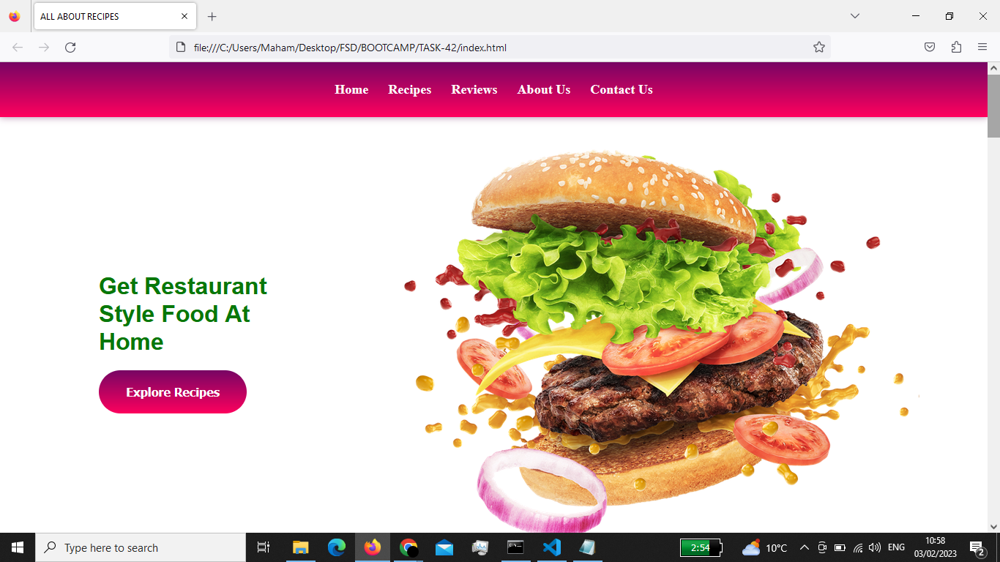
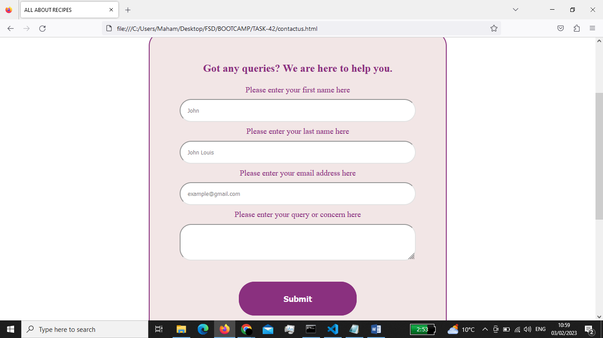

YOUR RECIPES README
Project Name
Your Recipes

Description
Your recipe website is a digital platform where you can browse, search, and find various recipes for cooking and baking. It features an extensive collection of 
recipes covering various cuisines, diets, and meal types. You can however save your favorite recipes, like recipes, leave comments, and can get connected with us
through forms.
It provides step-by-step instructions, ingredients list, and cooking time, along with images and videos to help you prepare the dishes successfully. Your Recipe 
websites is a valuable resource for both experienced and novice cooks, offering inspiration and guidance for creating delicious meals at home.

Table of Contents
1.Project Description
2.Installation
3.Usage
4.Credits
5.Installation

To install Your Recipes Website, follow these steps:
1.Clone the repository from Github: https://github.com/mahamsshoaib/finalCapstone.git
2.Install the required dependencies: npm install
3.Start the development server: npm run start
4.Click Finish when you are done

Usage
Once installed, you can use Your Recipe Website as follows:
1.Open "index.html" where the project is downloaded.
2.To save a recipe for later, click the "Save" button located on the recipe page.
3.To access your saved recipes, click on the "Saved Recipes" tab in the menu.
4.To leave a comment scroll to the recipe on the recipe page and type your comment in the text field provided.
5.To contact us, click on "Contact Us" tab in the menu and fill out the form, our team will get back to you at your provided email address.

Your Recipes Website Screenshot

Credits
Your Recipe Website was created by Maham Shoaib. The project is open source and contributions are welcome.

We hope this guide helps you find and enjoy our recipes. If you have any questions or feedback, please contact us. Happy cooking!